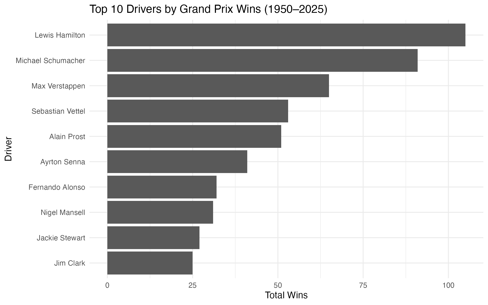

```{r setup, include=FALSE}
knitr::opts_chunk$set(echo = TRUE)
```

**Introduction**

This report uses the “Winners Formula 1 1950–2025” dataset. Objective: load the dataset, create a summary table of top winners, and visualize results with a figure.

**Table**

```{r}
top_winners <- readr::read_csv("output/table_top_winners.csv", show_col_types = FALSE)
gt::gt(top_winners) |>
gt::tab_header(title = "Top 10 Drivers by Wins (1950–2025)") |>
gt::cols_label(winner_name = "Driver", Wins = "Total Wins")
```

Description: The table shows the top 10 drivers with the most wins.

**Figure**



Description: The bar chart displays total wins for the top 10 drivers.
